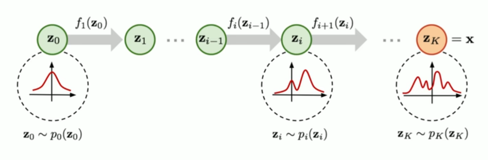
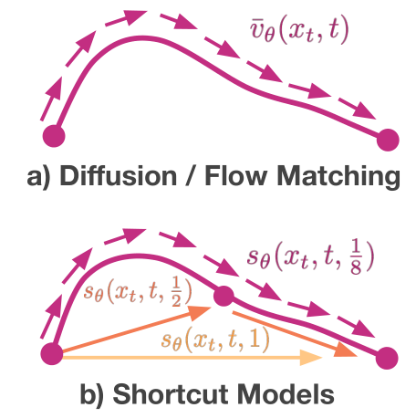
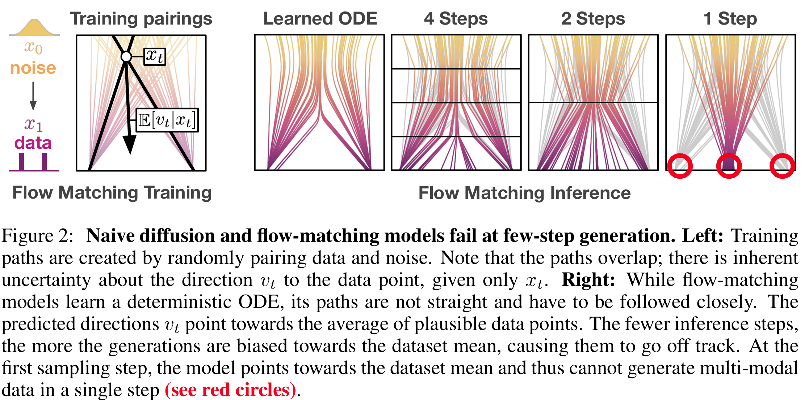
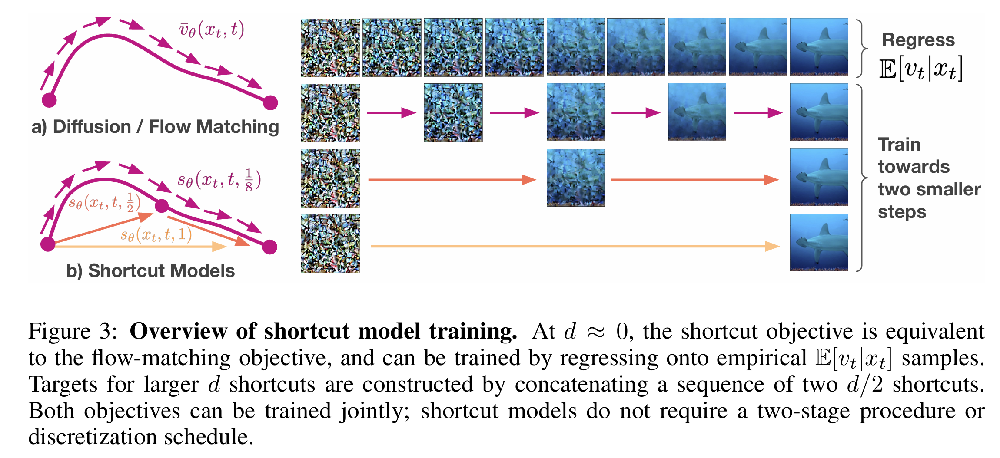
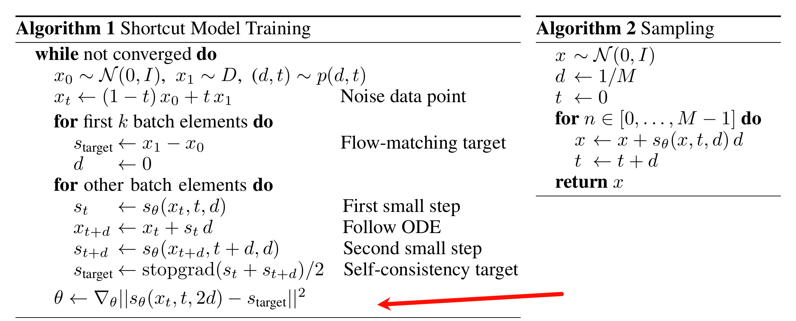

## Flow matching: Flow Matching for Generative Modeling

#### 前置知识

通量与散度

- 通量是单位时间内通过某个曲面的物理量，$\iint_{\Sigma} \vec{A} \cdot \vec{n} d S$

- 散度可用于表征空间各点矢量场发散的强弱程度，其实就是对函数求偏导再累加
  $$
  \operatorname{div} \vec{A}(M)=\lim _{\Omega \rightarrow M} \frac{1}{V} \oiint_{\Sigma} \vec{A} \cdot \vec{n} d S \\
  \operatorname{div} \mathbf{F}=\nabla \cdot \mathbf{F}=\frac{\partial F_x}{\partial x}+\frac{\partial F_y}{\partial y}+\frac{\partial F_z}{\partial z} \\\operatorname{div}=\sum_{i=1}^d \frac{\partial}{\partial x^i}
  $$

随机变量的关系-> 随机变量分布之间的关系：概率论中的概率密度函数变量变换，假设已知随机变量 $z$ 的概率密度函数为 $\pi(z)$，$x=f(z)$，且 $f$ 已知，则 $x$ 的分布为，
$$
p(x)=\pi(z)\left|\frac{d z}{d x}\right|=\pi\left(f^{-1}(x)\right)\left|\frac{d f^{-1}}{d x}\right|=\pi\left(f^{-1}(x)\right)\left|\left(f^{-1}\right)^{\prime}(x)\right|
$$
flow的基本概念：将一个分布通过一系列的可逆变换变成另一个分布的过程

有了flow的概念，就可以从噪声变换到数据，比如：$x_t = (f_tf_{t-1}...f_1)(x_0)$，将其记作 $\phi_t$，即$x_t = \phi_t(x_0)$， $t \in [0,T]$，归一化为 $t \in [0,1]$，则可以写成 ODE的过程（continuous normalizing flow：）：
$$
\begin{aligned}
\frac{d}{d t} \phi_t(x) & =v_t\left(\phi_t(x)\right) \\
\phi_0(x) & =x
\end{aligned}
$$
其中的 $v_t$ 为速度，速度矢量，初始的 $\phi_0$ 不对 $x$ 做变化，则 $x_{t+\Delta t} = x_t + \Delta t v_t$，$x_0$ 为噪声，$x_1$ 为图像。

Flow：$\phi_t$， time-dependent vector field：$v_t$，probability density path：$p_t$

push-forward equation：$p_t = [\phi_t]_*p_0 = p_0\left(\phi^{-1}(x)\right)\left|\left(\phi^{-1}\right)^{\prime}(x)\right|$，表示对随机变量的分布的变换

Continue equation：确保一个向量场 $v_t$ 可生成概率路径 $p_t$ ，则一定有
$$
\frac{d}{d t} p_t(x)+\operatorname{div}\left(p_t(x) v_t(x)\right)=0
$$

### flow-matching

 $t \in [0,1]$，$x_0$ 为噪声，$x_1$ 为图像，FM的损失函数为：
$$
\mathcal{L}_{\mathrm{FM}}(\theta)=\mathbb{E}_{t, p_t(x)}\left\|v_t(x)-u_t(x)\right\|^2
$$
让神经网络预测 $v_t$ 去预测ground-truth $u_t$。gt怎么求？无条件的向量场 $u_t(x)$ 求不出来，求条件向量场 $u_t(x|x_1)$

**定理1**：为什么预测条件向量场可以等价于预测原始的不带条件的向量场？给定向量场 $u_t(x|x_1)$，其可以产生条件概率路径 $p_t(x|x_1)$，则对于任意分布 $q(x_1)$，边缘向量场 $u_t$ 可以生成边缘概率路径 $p_t$，即 $u_t(x|x_1) \rightarrow p_t(x|x_1)$，证明：$u_t(x) \rightarrow p_t(x)$

即为了证明
$$
\frac{d}{d t} p_t(x)=-\operatorname{div}\left(p_t(x) v_t(x)\right)=0
$$
证明：由给定条件可知，continue equation成立，因此有
$$
\frac{d}{{dt}}{p_t}\left( {x\mid {x_1}} \right) =  - {\rm{div}}\left( {{u_t}\left( {x\mid {x_1}} \right){p_t}\left( {x\mid {x_1}} \right)} \right)
$$
则：
$$
\begin{aligned}
\frac{d}{{dt}}{p_t}(x) &= \frac{d}{{dt}}\int {{p_t}(x|{x_1})q\left( {{x_1}} \right)d{x_1}} \\
 &= \int {\left( {\frac{d}{{dt}}{p_t}\left( {x\mid {x_1}} \right)} \right)} q\left( {{x_1}} \right)d{x_1}\\
 &=  - \int {{\mathop{\rm div}\nolimits} } \left( {{u_t}\left( {x\mid {x_1}} \right){p_t}\left( {x\mid {x_1}} \right)} \right)q\left( {{x_1}} \right)d{x_1}\\
 &=  - {\mathop{\rm div}\nolimits} \left( {\int {{u_t}} \left( {x\mid {x_1}} \right){p_t}\left( {x\mid {x_1}} \right)q\left( {{x_1}} \right)d{x_1}} \right)\\
 &=  - {\mathop{\rm div}\nolimits} \left( {{u_t}(x){p_t}(x)} \right)
\end{aligned}
$$
由最后两步可知：
$$
{u_t}(x) = \frac{{\int {{u_t}} \left( {x\mid {x_1}} \right){p_t}\left( {x\mid {x_1}} \right)q\left( {{x_1}} \right)d{x_1}}}{{{p_t}(x)}}
$$
也就是$u_t$ 满足上式，以上的定理一才能成立。

如何设计损失函数？作者没有设计，直接替换为条件向量场：
$$
\mathcal{L}_{\mathrm{FM}}(\theta)=\mathbb{E}_{t, p_t(x)}\left\|v_t(x)-u_t(x)\right\|^2 \Leftrightarrow \mathcal{L}_{\mathrm{CFM}}(\theta)=\mathbb{E}_{t, q\left(x_1\right), p_t\left(x \mid x_1\right)}\left\|v_t(x)-u_t\left(x \mid x_1\right)\right\|^2
$$
**定理2**：如何设计损失函数？假设对于 $\forall x \in {R^d},t \in [0,1]$，$p(x) > 0$，则 $\mathcal{L}_{\mathrm{FM}}$ 与 $\mathcal{L}_{\mathrm{CFM}}$相等（顶多差一个与 $\theta$ 无关的常数），两函数梯度一致 ${\nabla _\theta }\mathcal{L}_{\mathrm{FM}} = {\nabla _\theta } \mathcal{L}_{\mathrm{CFM}}$

由下式：
$$
\begin{aligned}
\left\|v_t(x)-u_t(x)\right\|^2 & =\left\|v_t(x)\right\|^2-2\left\langle v_t(x), u_t(x)\right\rangle+\left\|u_t(x)\right\|^2 \\
\left\|v_t(x)-u_t\left(x \mid x_1\right)\right\|^2 & =\left\|v_t(x)\right\|^2-2\left\langle v_t(x), u_t\left(x \mid x_1\right)\right\rangle+\left\|u_t\left(x \mid x_1\right)\right\|^2
\end{aligned}
$$
最后一项都是gt，与$\theta$无关，因此只需要证明中间项一致即可，注意积分的下标不同
$$
\begin{aligned}
\begin{array}{l}
{E_{{p_t}\left( x \right)}}{\left\| {{v_t}(x)} \right\|^2} &= \int {{{\left\| {{v_t}(x)} \right\|}^2}{p_t}\left( x \right)dx} \\
 &= \int {{{\left\| {{v_t}(x)} \right\|}^2}{p_t}(x|{x_1})q({x_1})d{x_1}dx} \\
& = {E_{q\left( {{x_1}} \right),{p_t}\left( {x|{x_1}} \right)}}{\left\| {{v_t}(x)} \right\|^2}
\end{array}
\end{aligned}
$$
第二项
$$
\begin{aligned}
\begin{array}{l}
{E_{{p_t}\left( x \right)}}\left\langle {{v_t}(x),{u_t}(x)} \right\rangle & = \int {\left\langle {{v_t}(x),\frac{{\int {{u_t}} \left( {x\mid {x_1}} \right){p_t}\left( {x\mid {x_1}} \right)q\left( {{x_1}} \right)d{x_1}}}{{{p_t}(x)}}} \right\rangle {p_t}(x)dx} \\
 &= \int {\left\langle {{v_t}(x),\int {{u_t}} \left( {x\mid {x_1}} \right){p_t}\left( {x\mid {x_1}} \right)q\left( {{x_1}} \right)d{x_1}} \right\rangle dx} \\
& = \int {\left\langle {{v_t}(x),{u_t}\left( {x\mid {x_1}} \right)} \right\rangle {p_t}\left( {x\mid {x_1}} \right)q\left( {{x_1}} \right)d{x_1}dx} \\
 &= {E_{{p_t}\left( {x\mid {x_1}} \right),q\left( {{x_1}} \right)}}\left\langle {{v_t}(x),{u_t}\left( {x\mid {x_1}} \right)} \right\rangle 
\end{array}
\end{aligned}
$$
证毕。

**定理3**：条件向量场的具体表达形式是什么？不知道，就加假设，假设高斯形式的条件概率路径，即
$$
\begin{aligned}
p_t\left(x \mid x_1\right) &=\mathcal{N}\left(x \mid \mu_t\left(x_1\right), \sigma_t\left(x_1\right)^2 I\right)\\
\psi_t(x)&=\sigma_t\left(x_1\right) x+\mu_t\left(x_1\right)
\end{aligned}
$$
对于以上条件概率路径期望有
$$
\left\{ {\begin{array}{*{20}{c}}
{t = 0 \Rightarrow {\mu _0}({x_1}) = 0,{\sigma _0}({x_1}) = 1}\\
{t = 1 \Rightarrow {\mu _1}({x_1}) = {x_1},{\sigma _1}({x_1})small}
\end{array}} \right.
$$
即一开始是噪声，最后尽量收敛到真实数据附近。那么如何将初始的噪声，推到 $x_t$ 位置呢？即利用 $\psi_t$，由 $x \sim {\cal N}\left( {0,1} \right) \Rightarrow {\psi _t}(x) \sim {\cal N}\left( {{\mu _t}\left( {{x_1}} \right),{\sigma _t}{{\left( {{x_1}} \right)}^2}I} \right)$，因此由 $\psi_t$ 变换可以走到 条件概率路径 $p_t\left(x \mid x_1\right)$这里。有了 条件概率路径 $p_t\left(x \mid x_1\right)$ 和 $\psi_t$，就可以计算 $u_t$ 了。

由ODE可知，
$$
\frac{d}{d t} \psi_t(x)  =u_t\left(x|x_1\right)
$$
对其求导可得：
$$
{\sigma _t}^\prime \left( {{x_1}} \right)x + {\mu _t}^\prime \left( {{x_1}} \right) = {u_t}\left( {x|{x_1}} \right) = {u_t}\left( {{\psi _t}(x)|{x_1}} \right)
$$
后面 $x=\psi _t(x)$ 是由于 $t$ 时刻已经到了 $\psi _t(x)$ 这个位置，因此有
$$
\frac{{{\sigma _t}^\prime \left( {{x_1}} \right)}}{{{\sigma _t}\left( {{x_1}} \right)}}\left( {{\psi _t}(x) - {\mu _t}\left( {{x_1}} \right)} \right) + {\mu _t}^\prime \left( {{x_1}} \right) = {u_t}\left( {{\psi _t}(x)|{x_1}} \right)
$$
这是直接利用  $\psi_t(x)$ 定义求 $x$，带入即可 ，再替换一下即可
$$
u_t\left(x \mid x_1\right)=\frac{\sigma_t^{\prime}\left(x_1\right)}{\sigma_t\left(x_1\right)}\left(x-\mu_t\left(x_1\right)\right)+\mu_t^{\prime}\left(x_1\right)
$$

高斯条件概率路径的特殊形式，概率条件路径，
$$
\begin{aligned}
p_t\left(x \mid x_1\right)&=\mathcal{N}\left(x \mid \mu_t\left(x_1\right), \sigma_t\left(x_1\right)^2 I\right) \\ \psi_t(x)&=\sigma_t\left(x_1\right) x+\mu_t\left(x_1\right) \\ u_t\left(x \mid x_1\right)&=\frac{\sigma_t^{\prime}\left(x_1\right)}{\sigma_t\left(x_1\right)}\left(x-\mu_t\left(x_1\right)\right)+\mu_t^{\prime}\left(x_1\right)
\end{aligned}
$$
Variance exploding path：当方差很大的时候，就是score matching
$$
p_t\left(x \mid x_1\right) =\mathcal{N}\left(x \mid x_1, \sigma_{1-t}^2 I\right)
$$
variance preserving path：DDPM 也是一个特例
$$
p_t\left(x \mid x_1\right) =\mathcal{N}\left(x \mid \alpha_{1-t}x_1, (1-\alpha_{1-t}^2) I\right)
$$
最优传输条件，flow matching
$$
\mu_t(x)=t x_1, \text { and } \sigma_t(x)=1-\left(1-\sigma_{\min }\right) t
$$
令 $\sigma=0$，则 $\psi_t(x)=(1-t)x+t x_1$，定义的是直线。

## Shortcut model: One Step Diffusion via Shortcut Models

flow matching往往需要多个采样去噪时间步生成图像，步数少时效果不好；shortcut直接将采样时间步长条件化，从而模型可以根据时间步长 $h$ 生成对应的向量场

对于Rectified flow，假设有噪声点 $x_0 \sim \mathcal{N}(0, I)$，数据点 $x_1$，前向加噪过程和向量场为
$$
x_t = (1-t) x_0 + t x_1, v_t = x_1 - x_0
$$
给定 $x_0$ 和 $x_1$ 条件下 $v_t$ 完全确定，但是只给定 $x_t$， 却会有多个 $(x_0,x_1)$ 满足这个线性组合要求。

因此给定 $x_t$ 的情况下， $v_t$ 其实是个随机变量，所以学习的向量场其实是一个平均意义上的期望
$$
\bar v_t = E[v_t|x_t]
$$
 flow matching的目标是参数化一个 $\bar v_t(x_t, t)$ 去近似上式，即
$$
\bar{v}_\theta\left(x_t, t\right) \approx \mathbb{E}_{x_0, x_1 \sim D}\left[v_t \mid x_t\right] \quad \text { and } \quad \mathcal{L}^F(\theta)=\mathbb{E}_{x_0, x_1 \sim D}\left[\left\|\bar{v}_\theta\left(x_t, t\right)-\left(x_1-x_0\right)\right\|^2\right]
$$
当模型收敛之后就可以通过数值解法去求解这个ODE，利用欧拉法
$$
x_t = x_{t-1} + d \times \bar v_\theta (x_t, t)
$$
当 $d \rightarrow 0$ 时，结果越准确，这是因为上式是基于匀速直线运动做的假设，因此每次的步长越小，就越准确；当 $x_0 \rightarrow x_1$ 方向是直线，则步长 $d$ 不再需要趋于0，可直接一步从 $x_0$ 到 $x_1$。shortcut model，则将步长 $h$ 也作为条件去作为先验学习
$$
\begin{gathered}
x_t=x_{t-1}+d \times \bar{v}_\theta\left(x_t, t\right) \\
\downarrow \\
x_t=x_{t-1}+d \times \bar{v}_\theta\left(x_t, t, d\right) \\
\downarrow \\
x_{t+d}^{\prime}=x_t+d \times s\left(x_t, t, d\right)
\end{gathered}
$$
采用shortcut模型的自一致性属性进行优化，即
$$
\begin{aligned}
x_{t+d}^{\prime} &=x_t+d \times s\left(x_t, t, d\right)\\
& \downarrow \\
x_{t+2d}^{\prime} &=x_t+2d \times s\left(x_t, t, 2d\right)\\
& \downarrow \\
x_{t+2d}^{\prime} &=x_{t+d}^{\prime} + d \times s\left(x_{t+d}^{\prime}, t +d, d\right)\\
\end{aligned}
$$
则通过替换
$$
\begin{aligned}
x_{t+2d}^{\prime} &=x_{t} + d \times s\left(x_t, t, d\right) + d \times s\left(x_{t+d}^{\prime}, t +d, d\right)\\
& =x_{t} + d \times [s\left(x_t, t, d\right) +  s\left(x_{t+d}^{\prime}, t +d, d\right)
\end{aligned}
$$
则
$$
s\left(x_t, t, 2d\right) =\frac{s\left(x_t, t, d\right)}{2} +  \frac{s\left(x_{t+d}^{\prime}, t +d, d\right)}{2}
$$
将其当作flow matching损失的一部分，可得到最终的损失函数
$$
\begin{gathered}
\mathcal{L}^S(\theta)=\mathbb{E}_{x_0 \sim \mathcal{N}, x_1 \sim D,(t, d) \sim p(t, d)}\left[\left\|s_\theta\left(x_t, t, 0\right)-\left(x_1-x_0\right)\right\|^2+\left\|s_\theta\left(x_t, t, 2 d\right)-s_{\text {target }}\right\|^2\right] \\
\text { where } \quad s_{\text {target }}=s_\theta\left(x_t, t, d\right) / 2+s_\theta\left(x_{t+d}^{\prime}, t+d, d\right) / 2 \quad \text { and } \quad x_{t+d}^{\prime}=x_t+d \times s_\theta\left(x_t, t, d\right)
\end{gathered}
$$
其中， $s_\theta(x_t, t, 0)$ 是原来的flow matching损失，里面0相当于步长为0的向量场，当模型收敛时就可以使用不同步长 $d$ 去生成图像

将batch分成1：3的比例分别训练flow-matching target和self-consistency target

